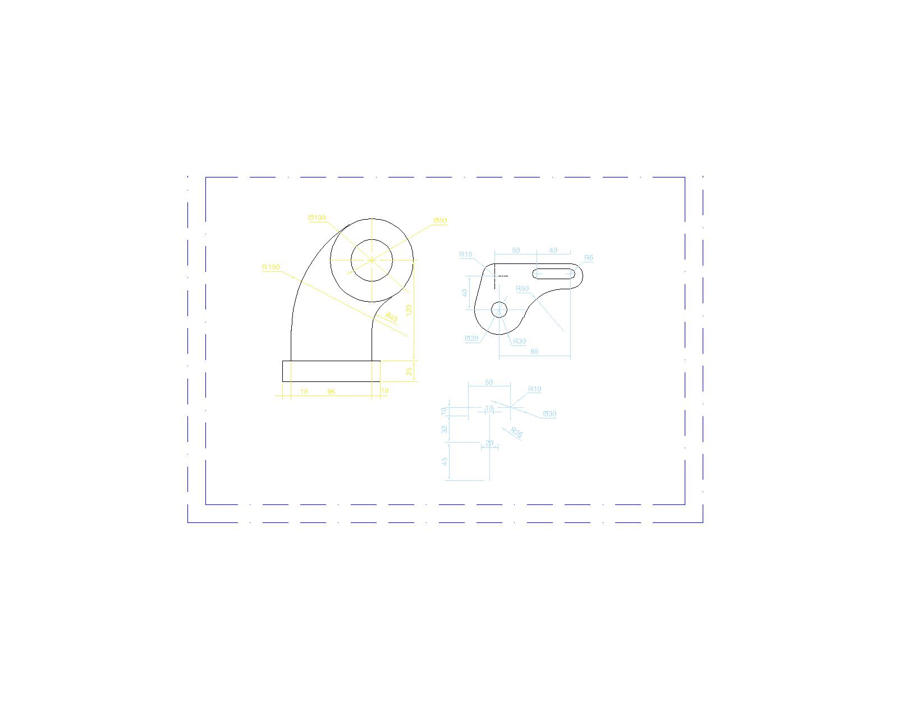

# Week 2 - Orthographic Drawing

This week’s practice focuses on an orthographic projection of a mechanical component.  
The drawing includes:
- Front, side, and top views
- Proper dimensions and scaling
- Drafting done in AutoCAD

